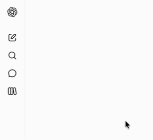
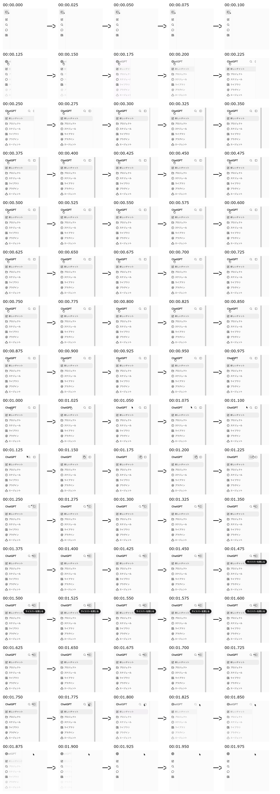

# motion-to-storyboard

Turn motion into compact, timestamped visual context for AI. [Why? →](#why)

## ✨ Example

| Input | Output |
| --- | --- |
|  |  |

```sh
go run ./cmd/motion-to-storyboard -interval 25ms docs/input.gif docs/output.png
```

## 🔧 Requirements

- Go 1.27.1 or later (when installing from source)
- `ffmpeg` and `ffprobe` available on `PATH`

Any format that the installed FFmpeg and ffprobe can read is accepted as input, including MP4 and GIF. Supported formats depend on the FFmpeg build.

## 🚀 Get Started

Install the CLI:

```sh
go install github.com/takara2314/motion-to-storyboard/cmd/motion-to-storyboard@latest
```

Or run it from this repository:

```sh
go run ./cmd/motion-to-storyboard INPUT_VIDEO OUTPUT_IMAGE
```

Use [Gyazo Video](https://gyazo.com/) to capture screen interactions before converting them to a storyboard.

```text
motion-to-storyboard [options] INPUT_VIDEO OUTPUT_IMAGE
```

The smallest useful command is:

```sh
motion-to-storyboard INPUT_VIDEO OUTPUT_IMAGE
```

Sample frames from 1.5 to 3 seconds at 50 ms intervals:

```sh
motion-to-storyboard \
  -start 00:01.500 \
  -end 00:03.000 \
  -interval 50ms \
  -columns 6 \
  INPUT_VIDEO OUTPUT_IMAGE
```

Crop the center of a video:

```sh
motion-to-storyboard \
  -x 'iw/4' -y 'ih/4' -w 'iw/2' -h 'ih/2' \
  INPUT_VIDEO OUTPUT_IMAGE
```

## ⚙️ Options

| Option | Default | Description |
| --- | --- | --- |
| `-interval` | `100ms` | Frame sampling interval |
| `-scale` | `1.0` | Scale applied to each frame after cropping |
| `-start` | `0s` | Start of the target range |
| `-end` | End of the input | End of the target range |
| `-x` | Unset | Crop left coordinate |
| `-y` | Unset | Crop top coordinate |
| `-w` | Unset | Crop width |
| `-h` | Unset | Crop height |
| `-columns` | `5` | Maximum frames in each row |

`-interval`, `-start`, and `-end` accept `100ms`, `0.1s`, `00:00.100`, and `01:02:03.456`.

Crop values use FFmpeg crop-filter expressions. Specify all of `x`, `y`, `w`, and `h`, or omit them all.

## 📐 Behavior

- The first sampled frame is the start of the target range; the end timestamp is excluded.
- Timestamps are relative to the start of the target range.
- Each row contains at most `-columns` frames.
- An arrow is displayed only when the next frame is present in the same row.
- Cropping runs before scaling.
- The output extension determines the image format through FFmpeg.
- An existing output file is overwritten.

## ⚠️ Errors and limits

The CLI rejects missing input paths, invalid timestamps, non-positive `-interval` or `-scale`, an end time that is not after the start time, incomplete crops, non-positive `-columns`, and ranges outside the input duration.

There is no application-level frame limit. A long input or very short interval can create an image too large for FFmpeg or available memory; increase `-interval` or narrow the range with `-start` and `-end`.

<a id="why"></a>

## 💡 Why

Motion is often the missing context when asking an AI to explain a UI flow, review an interaction, or help reproduce an animation. Instead of attaching a video or describing each step manually, convert the relevant clip into a timestamped storyboard and include the output image in your prompt.

```text
screen recording or animation → motion-to-storyboard → image attached to an AI prompt
```

For example:

```sh
motion-to-storyboard -interval 100ms recording.mp4 storyboard.png
```

Then ask your AI: “Describe this interaction, including the order and timing of each change.”

## 🛠️ Development

```sh
go test ./...
go vet ./...
go build ./...
```

Tests cover timestamps, validation, layout rules, command boundaries, and rendering a short video. Integration tests are skipped when FFmpeg is unavailable.
